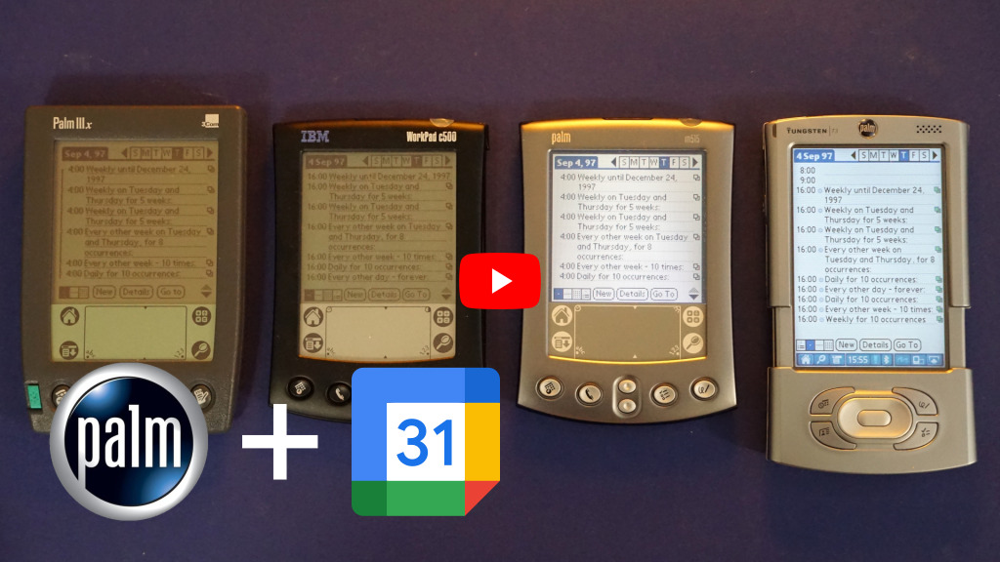

# palm-calendar-sync2
Make your Palm Pilot useful again by downloading your calendar to it (attempt #2).

If you've got an old [Palm Pilot](https://en.wikipedia.org/wiki/PalmPilot) kicking around you've probably had some fun play-time nostalgia getting it out, but noticed that it's not so easy to make use of it's PIM functionality now that almost all of that stuff is an online service. This project attempts to remedy that somewhat for the Datebook function.

`calendary-sync2` is a stand-alone tool to read an [iCaliendar](https://en.wikipedia.org/wiki/ICalendar) (ical/ics)  formatted date-book/calendar and send it to a Palm Pilot using a HotSync. This should allow for an up-to-date at the time of HotSync calendar to be made available on a Palm device.

A YouTube video outlining the project:

[](https://www.youtube.com/watch?v=iAAXIlFZGh8)

## Background

I previously attempted a similar project, [google-calendar-to-palm-pilot](https://github.com/guruthree/google-calendar-to-palm-pilot), but ran into several probably fatal flaws that led to me abandoning it:

1. No way to handle moved/deleted repeat events
2. The calendar was always overwritten
3. Dependency on python2.7 requiring a [conda](https://docs.conda.io/en/latest/) environment
4. Dependency on the [pilot-datebook](https://github.com/guruthree/pilot-datebook) tool
5. No alarms would be copied

These issues have been addressed by writing the application in C this time and directly using the pilot-link libpisock library.

## Features

* Fetches calendars over http/https
* Read and merges calendar with existing calendar, preserving any Palm-only Datebook events
* Works with USB, serial, and network HotSync
* Fully compatible (I hope) with the [Google-calendar ics export](https://support.google.com/calendar/answer/37648?hl=en#zippy=%2Cget-your-calendar-view-only)
* Alarms (optional)
* Repeating events, with exclusions and moved events
* Descriptions, location, and attendees added to a Note
* Dates and times translated to specified time zone

## Compiling

Dependencies:

* pilot-link/libpisock
* libconfig
* libcurl
* libical
* libusb/libusb-compat
* gcc and cmake for compiling

Unfortunately not all distributions distribute pilot-link any more. Some distributions that do include [Arch Linux](https://aur.archlinux.org/packages/pilot-link), [Gentoo](https://packages.gentoo.org/packages/app-pda/pilot-link), and [Fedora](https://packages.fedoraproject.org/pkgs/pilot-link/pilot-link/). However, Debian, Ubuntu, and OpenSuse no longer include pilot-link with their latest versions.

If your distribution does not distribute a pilot-link package, there are a few options. You can compile from source, either using the [archive git repo and Gentoo patch set](https://github.com/jichu4n/pilot-link/issues/3) or a [more recently maintained fork](https://github.com/desrod/pilot-link). It might also be possible to use the binaries from another distribution that still packages pilot-link.

After installing the dependencies (which make include dependency-devel packages on some distributions) then building `calendary-sync2` is straight forward.

In words:

1. Download this repository (e.g., using `git clone` or the GitHub "Download ZIP" function)
1. In the `palm-calendary-sync2` directory, create a `build` directory
1. Inside `build` directory, initialise the make system using `cmake ..`
1. Compile using `make`

In commands:

```
wget https://github.com/guruthree/palm-calendary-sync2/archive/refs/heads/main.zip
unzip palm-calendary-sync2-main.zip
cd palm-calendary-sync2-main
mkdir build
cd build
cmake ..
make
```

These steps will produce the `calendary-sync2` binary. Theoretically this should all work on Windows with the [Windows Subsystem for Linux](https://learn.microsoft.com/en-us/windows/wsl/install) (WSL) or [Cygwin](https://www.cygwin.com/), but I haven't tested this.

## Usage

After downloading and configuring `calendary-sync2`, the general usage would be as follows:

1. Run `calendary-sync2`
2. Trigger a HotSync
3. Enjoy using your Palm to browse your upcoming events

More specifically, `calendary-sync2` is controlled primarily through the `datebook.cfg` and [an example](https://github.com/guruthree/palm-calendary-sync2/blob/main/datebook.cfg) is included that will sync the libical recurring event test file to a Palm device connected via USB. This config file contains explanations of the configuration options, but the most important settings are:

* `URI` which specifies the location of the calendar.
* `PORT` which specifies how the Palm will connect (typically either via "usb:" or a serial port such as "/dev/ttyUSB0").
* `OVERWRITE` which will specify if `calendary-sync2` overwrites the existing Datebook on the Palm. **Note, by default `calendar-sync2` will overwrite the existing Datebook.**

Useful settings include:

* `TIMEZONE` which should be set to your local time zone so that events are at the correct times and not UTC.
* `FROMYEAR` as a YYYY year indicates a cut-off year for events to be copied to the palm to reduce resource consumption.
* `DOALARMS` true/false do/do not transfer alarms/reminders to the Palm. The Palm's alarm settings are not very granular so the option to disable them is provided to avoid being woken up at 3 AM.

If your Palm has been recently been reset, a HotSync may not work until the Datebook has been initialised by create an event.

Run without options `calendary-sync2` will run according to the `datebook.cfg` configuration file. It can however be instead run as `calendary-sync2 -h` to review a list of command line arguments.

```
palm-calendary-sync2-main/build $ ./sync-calendar2 -h
    ==> Reading arguments <==
    Argument -h

    sync-calendar2, a tool for copying an ical calendar to Palm

    Usage: sync-calendar2 [options]

    Options:

        -c  Specify config file (default datebook.cfg)
        -h  Print this help message and quit
        -p  Override config file port (e.g., /dev/ttyS0, net:any, usb:)
        -u  Override calendar URI
```

When running, `calendary-sync2` will produce output to verify that it is reading events correctly and provide information on the HotSync progress.

If you would like to sync multiple calendars to your Palm device, disable overwriting in the config and either utilise multiple configuration files with the `-c` option specifying each config file, or setup a generic config and change the calendar being synced using the `-u` option. Unfortunately there is currently no way to transfer multiple calendars in a single HotSync.
